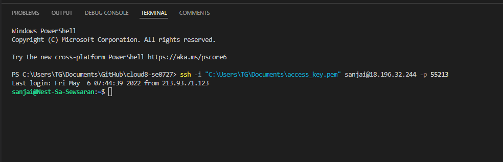

# Setting Up
OpenSSH is a (powerful collection of) tools for the remote control of, and transfer of data between networked computers. 

OpenSSH is a freely available version of the Secure Shell (SSH) protocol family of tools for remotely controlling, or transferring files between computers. 
Traditional tools used to accomplish these functions, such as telnet or rcp, are insecure and transmit the user’s password in cleartext when used. OpenSSH provides a server daemon and client tools to facilitate secure, encrypted remote control and file transfer operations, effectively replacing the legacy tools.

We will install OpenSSH using Windows settings and using PowerShell.
OpenSSH is a connectivity tool for remote login that uses the SSH protocol. It encrypts all traffic between client and server to eliminate eavesdropping, connection hijacking, and other attacks.

An OpenSSH-compatible client can be used to connect to Windows Server and Windows client devices.
Both OpenSSH components can be installed using Windows Settings on Windows Server 2019 and Windows 10 devices.
To install OpenSSH using PowerShell, run PowerShell as an Administrator. 
Once installed, you can connect to OpenSSH Server from a Windows 10 or Windows Server 2019 device with the OpenSSH client installed using PowerShell (Be sure to run PowerShell as an administrator) as follows: ssh username@servername

## Key terminology

OpenSSH
see above

PowerShell
PowerShell is an open source shell and scripting language built on top of Microsoft .NET technology
PowerShell is two things; it’s a command-line shell that allows users to run commands at a command-line similar to the legacy command prompt (cmd.exe). It is also a robust scripting language (designed especially for system administration) that can build tools and automate just about anything you can think of. Built on the .NET Framework, Windows PowerShell helps IT professionals to control and automate the administration of the Windows operating system and applications that run on Windows Server environment.

## Exercise
* Make an SSH-connection to your machine. SSH requires the key file to have specific permissions, so you might need to change those.
* When the connection is successful, type whoami in the terminal. This command should show your username.

### Sources

https://docs.microsoft.com/en-us/windows-server/administration/openssh/openssh_install_firstuse

https://ubuntu.com/server/docs/service-openssh

https://adamtheautomator.com/what-is-powershell/

https://www.tutorialspoint.com/powershell/powershell_scripting.htm

### Overcome challanges

### Results

 