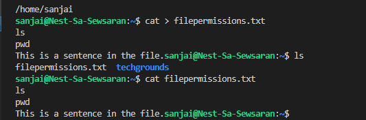
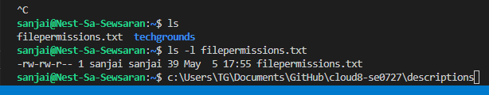
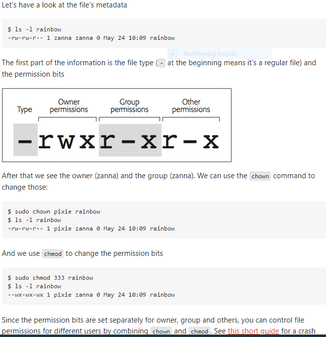
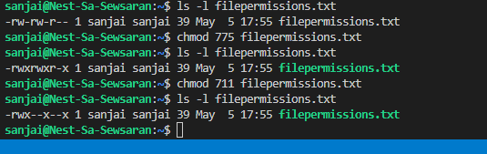
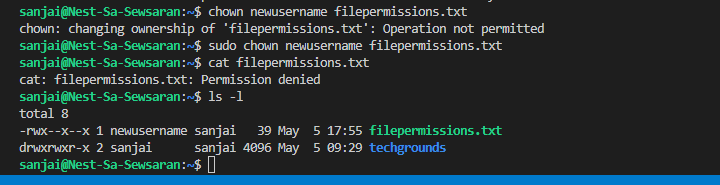
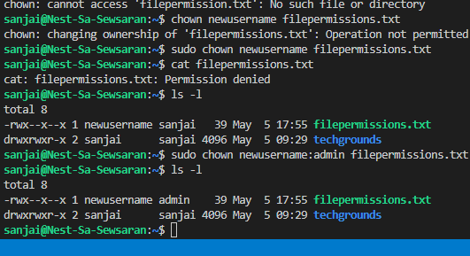

# File Permissions

If you want to see the the permission of a file you can use ls -l /path/to/file command.

For example

   ls -l acroread 
   -rwxr-xr-x 1 10490 floppy 17242 May  8  2013 acroread

What does this mean ?

First - represents a regular file. It gives you a hint of the type of object it is. It can have following values.

d (directory)
c (character device)
l (symlink)
p (named pipe)
s (socket)
b (block device)
D (door)
- (regular file)

r represents read permission.
w represents write permission and
x represents executable permission.

First combination of rwx represents permission for the owner .
Second combination of rwx represents permission for the group .
Third combination of rwx represents permission for the other of the file.

owner and group of a file:
 file, for example (s)he can use chmod to changes its mods (say permissions) to define who can do what.

$ ls -l file
-rwxrwxr-x  2  ravexina admins   26 May  9 12:49 file
At the above line we can see that ravexina is the owner of the file and admins is the group.

[Give a short summary of the subject matter.]

## Key terminology
file permissions, owner, group en other regarding a file, see above an example.

adding permissions to a file or group: chmod, using the absolute/numeric mode
adding permissions to a group: chown
Changing ownership and group in Linux
For changing the ownership of a file/directory, you can use the following command:
chown user filename
In case you want to change the user as well as group for a file or directory use the command
chown user:group filename

## Exercise
* Create a text file.
* Make a long listing to view the file’s permissions. 

Who is the file’s owner and group? sanjai is the owner and the group is also sanjai
What kind of permissions does the file have? -rw-rw-r--
owner has the following rights read and write
the group has also read and write permission
others have only read permission.

* Make the file executable by adding the execute permission (x).

* Remove the read and write permissions (rw) from the file for the group and everyone else, but not for the owner. Can you  still read it?
* Change the owner of the file to a different user. If everything went well, you shouldn’t be able to read the file unless   you assume root privileges with ‘sudo’.
* Change the group ownership of the file to a different group.

### Sources
https://www.cyberciti.biz/faq/ubuntu-create-file-using-cat-command/
https://askubuntu.com/questions/528411/how-do-you-view-file-permissions
https://askubuntu.com/questions/918379/what-is-the-main-difference-between-chmod-and-chown/918382#918382
https://www.guru99.com/file-permissions.html

### Overcome challenges

### Results

