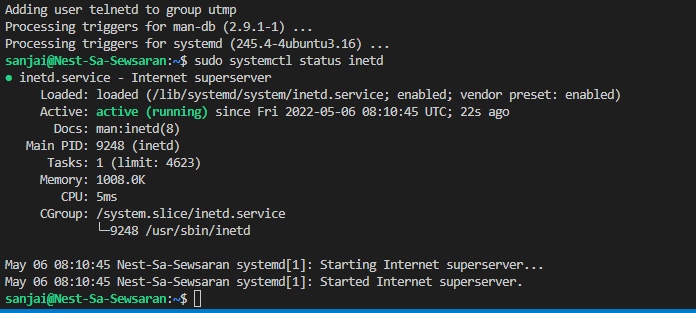

(# LNX-06 Processes

Linux processess are divided in Daemon. Service and Program processses.
a process is running code, which is stored somewhere on the system in Linux.
every process has its own PID number = process ID number

connecting to Linux machines:
* use ssh (secure shell)
* use Telnet (not secure, no encrypted connection)

##### Telnet
Is a terminal emulation program for TCP/IP networks such as the Internet. The Telnet program runs on your computer and connects your PC to a server on the network. You can then enter commands through the Telnet program and they will be executed as if you were entering them directly on the server console. This enables you to control the server and communicate with other servers on the network. To start a Telnet session, you must log in to a server by entering a valid username and password. Telnet is a common way to remotely control Web servers.

Telnet is fast but also insecure. It sends all your text, including your password, in plain text that can be read by anyone with the right tools. SSH, on the other hand, encrypts all your communication and so is more resource-intensive but secure

##### How to find out which Port number a process is using in Linux

A port is a logical connection that identifies a specific process on Linux. There are two kind of port are available like, physical and software. Since Linux operating system is a software hence, we are going to discuss about software port.

Software port is always associated with an IP address of a host and the relevant protocol type for communication. The port is used to distinguish the application.

As a Linux administrator, you should know whether the corresponding service is binding/listening with correct port or not.This will help you to easily troubleshoot further when you are facing port related issues.

Most of the network related services have to open up a socket to listen incoming network requests. Socket is unique for every service.
Socket is combination of IP address, software Port and protocol. The port numbers area available for both TCP and UDP protocol.

The Transmission Control Protocol (TCP) and the User Datagram Protocol (UDP) use port numbers for communication. It is a value from 0 to 65535.

Below are port assignments categories.

0-1023: Well Known Ports or System Ports
1024-49151: Registered Ports for applications
49152-65535: Dynamic Ports or Private Ports
You can check the details of the reserved ports in the /etc/services file on Linux.

Procedure to find process by name on Linux: pidof ....command as follows to find PID for firefox process:
pidof firefox

After a discussion with Casper, I understand that telnet is installed, but it is not running.
So that is why we do not have a PID of telnetd. There is no activity over the ports, no connection is made.

## Key terminology
Telnet
$PATH variable
PID number

[Write a list of key terminology with a short description. To prevent duplication you can reference to previous excersizes.]

## Exercise

* Start the telnet daemon.
* Find out the PID of the telnet daemon.
* Find out how much memory telnetd is using.
* Stop or kill the telnetd process.

### Sources
http://www.ubuntugeek.com/setting-up-a-telnet-server-in-ubuntu.html
https://www.linuxcapable.com/how-to-install-and-use-telnet-on-ubuntu-20-04/
https://www.2daygeek.com/how-to-find-out-which-port-number-a-process-is-using-in-linux/
https://www.cyberciti.biz/faq/linux-find-process-name/
https://www.sidmartinbio.org/where-is-inetd-conf-in-ubuntu/
https://www.distributednetworks.com/linux-network-admin/module4/inetd-daemon-vitalComponent-unixSystem.php
https://www.ibm.com/docs/en/aix/7.2?topic=processes-removing-background-process-kill-command

### Overcome challanges
[Give a short description of your challanges you encountered, and how you solved them.]

### Results

