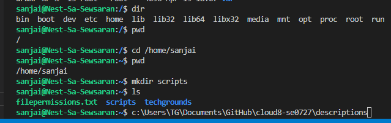
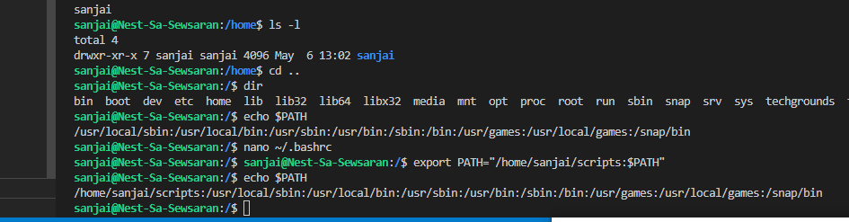
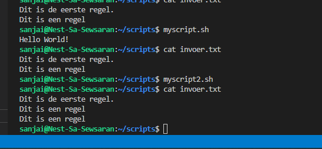
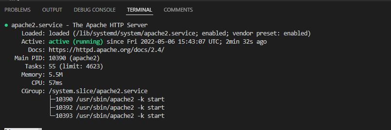
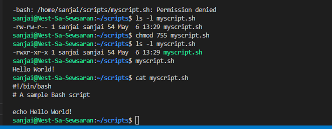
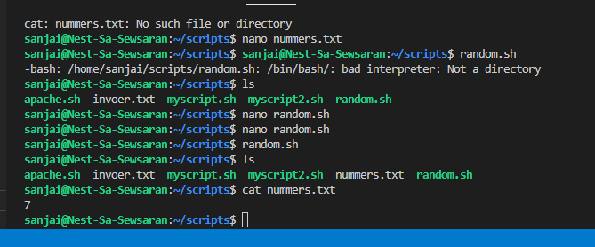
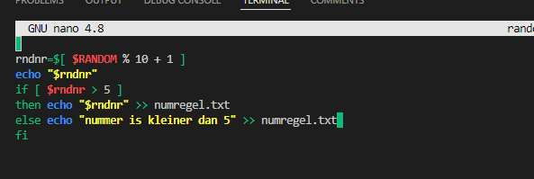
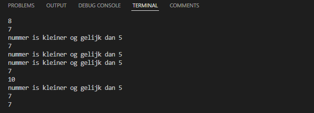

# Bash Scripting

Multiple or a series of commands in a row written in a text file  is a script (bash script).
A user needs to have permissions to be able to execute (x) the file (the script).
Linux will only be able to find the script if you specify the path name, or if you add the path to the directory in which the script lives, to the PATH variable.

Anything you can run normally on the command line can be put into a script and it will do exactly the same thing. Similarly, anything you can put into a script can also be run normally on the command line and it will do exactly the same thing.

It is convention to give files that are Bash scripts an extension of .sh 
Before we can execute a script it must have the execute permission set (for safety reasons this permission is generally not set by default). ls -l myscript.sh en chmod 755 myscript.sh

## Key terminology
The Shebang (#!) #!/bin/bash

This is the first line of the script above. The hash exclamation mark ( #! ) character sequence is referred to as the Shebang. Following it is the path to the interpreter (or program) that should be used to run (or interpret) the rest of the lines in the text file.

Generate Random numbers from the terminal

Run the following command to generate a random number.
$ echo $RANDOM
Run the following command to generate a random number within the range of 10 to 40. Here, the third bracket with $ has been used $ echo $[ $RANDOM % 40 + 10 ]

## Exercise
Exercise 1:
* Create a directory called ‘scripts’. Place all the scripts you make in this directory.
* Add the scripts directory to the PATH variable.
* Create a script that appends a line of text to a text file whenever it is executed.
* Create a script that installs the httpd package, activates httpd, and enables httpd. Finally, your script should print the status of httpd in the terminal.

Variables:
You can assign a value to a string of characters so that the value can be read somewhere else in the script.
Assigning a variable is done using ‘=’.
Reading the value of a variable is done using ‘$<insert variable name here>’.

Exercise 2:
* Create a script that generates a random number between 1 and 10, stores it in a variable, and then appends the number to a text file.

Conditions:
You can choose to only run parts of your script if a certain condition is met. For example, only read a file if the file exists, or only write to a log if the health check returns an error. This can be done using conditions.

A check for a condition can be done using ‘if’, ‘elif’, and/or ‘else’.

Exercise 3:
* Create a script that generates a random number between 1 and 10, stores it in a variable, and then appends the number to a text file only if the number is bigger than 5. If the number is 5 or smaller, it should append a line of text to that same text file instead.

### Sources
https://www.geeksforgeeks.org/introduction-linux-shell-shell-scripting/?ref=lbp

https://ryanstutorials.net/bash-scripting-tutorial/bash-script.php

https://linuxize.com/post/how-to-add-directory-to-path-in-linux/

https://ryanstutorials.net/bash-scripting-tutorial/bash-script.php

https://ryanstutorials.net/bash-scripting-tutorial/bash-variables.php

https://ryanstutorials.net/bash-scripting-tutorial/bash-input.php

https://ryanstutorials.net/bash-scripting-tutorial/bash-if-statements.php

https://ubuntu.com/tutorials/install-and-configure-apache#1-overview

https://docs.rackspace.com/support/how-to/centos-7-apache-and-php-install/

https://linuxhint.com/generate-random-number-bash/

### Overcome challanges
The main problem is u have to think step by step in scripting. It is almost litterally
building stone by stone. it requires logical thinking and comprehensive reading.
Also, when u are stuck, u are really stuck and better leave it, unless u can get partial solution.

### Results

