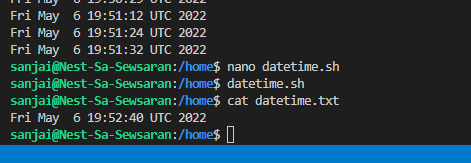

# Cronjobs

Processes that you want to execute on a regular schedule  can be automated using Cron jobs. 
Examples:
*  You might want to write the available disk space to a log file every hour. 
*  Or maybe you want to check for system updates every 2nd day of the month.

the basics of creating cron jobs is by editing crontab.

To create Cron jobs, or the commands that cron will execute, you simply run:
crontab -e
Cron jobs come in the form minute hour day month week command.

#!/bin/bash/
currentDate=date
echo $currentDate >> datetime.txt

How to View Free Disk Space and Disk Usage From the Linux Terminal (df)

## Key terminology

cron: This is the actual program you install on your system and run as a daemon.

cron job: A job in Linux is a program that is up and running. Cron can handle multiple tasks and run them at their scheduled time. Each of these tasks are referred to as ‘cron jobs’.

crontab: This is the file (and command) where you define what task to run and how often to run it. A crontab can have multiple cron jobs in it in a tabular form where each row is a cron job.

Simple date command returns the current date and time with the current timezone set in your system.

command df -h

## Exercise

* Create a Bash script that writes the current date and time to a file in your home directory.
* Register the script in your crontab so that it runs every minute.
* Create a script that writes available disk space to a log file in ‘/var/logs’. Use a cron job so that it runs weekly.

### Sources

https://itsfoss.com/cron-job/

https://crontab.guru/examples.html

https://www.cyberciti.biz/faq/unix-linux-getting-current-date-in-bash-ksh-shell-script/#:~:text=Sample%20shell%20script%20to%20display,scripts%20goes%20here%20%23%20...

https://phoenixnap.com/kb/set-up-cron-job-linux

### Overcome challenges
I had to make several changes in the $PATH and also in directories/permissions etc before i even could get started.
Also, the theory was quite new, luckily with the support of Tom and Killian, I did understand it better.
And also i learned a lot with all the struggles.

### Results

