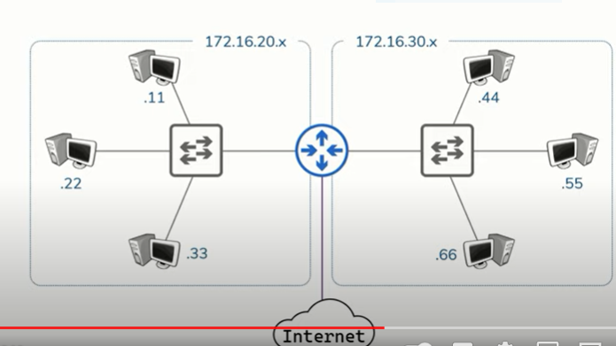
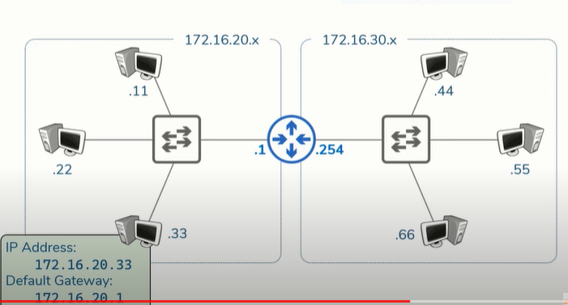
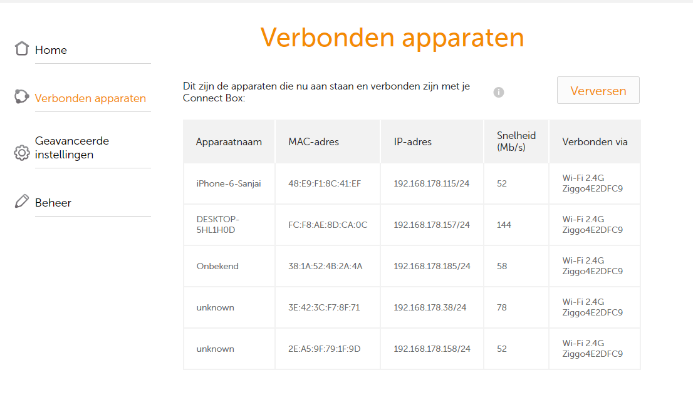
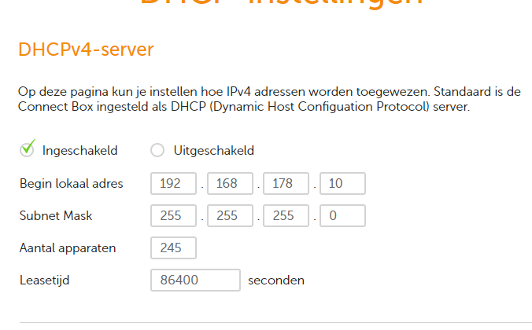

# Network Devices

### Network Devices
***
* Host

Host are any devices which send or either receives traffic/data over a network.
Examples: computers, phones, laptop, printer, server, cloudservers
Also Internet of Things devices (IoT) like TV, Speakers, Smart Watch, Lights, Refrigerator, Thermometers.
    * When they make a request, they are called Client
    * When they respond to a request they are called Server

So depending on the communication it acts as a Client or a Server.

* IP Address 
An IP Address is the identity of a host. Everything send on the Internet needs a SRC and a DST IP address. So in a request u have to SRC and DST IP address and in the response also. These are put in the header in the Transport Layer (OSI) / Network Layer (TCP/IP)

* A Network is what transports data traffic between hosts. The Internet is a network of networks.

* Repeater

A repeater regenerates/enhances the signal so u can communicate over larger distances. (wifi repeater)

* Hub

If u have multiple computers which need to be connected each to each other, u use a HUB. A Hub is a multi-port repeater.

There is only one big problem with a Hub, everything send between two computers will also be send to the othe other devices connected on that Hub/Network. To solve that problem we have bridges.

* Bridge

Bridges are used between Hub connected hosts.
Bridges have only two ports.
Bridges learn which hosts are on each side. They can sent data only on one side, or from one side to another on one or multiple computers.

* Switch

Switches facilitate communication **within** a Network (a group of hosts which all require the same connectivity)
Hosts on a Network share the same IP address space (
    i.e. only a few digits differ to give them all an unique IP address)

* Router

Routers facilitates communication **between** networks and/or internet. Routers have an access point to networks and internet and therefore are a great place to place /control point for security, filtering, redirecting etc.

Routers learn (have IP addresses in the Networks they aree placed) which networks they are attached too = Routes. These Routes are stored in a Routing Table.
Routing Table: all networks the Router knows about (to direct the traffic).

The IP address of the router in the Network is going to serve a a local's host way out of their local Network to other Networks or the Internet. This is called: Default Gateway (IP address of router in that Network).

***

### The OSI Model and Network Devices

The OSI model is basically an overview of how data flows through the Internet. The goal is too allow two or more hosts to share data with one another. This can be done with devices.

***
## Key terminology

see above

***
## Exercise

Bestudeer:
 * Netwerkapparaten

 * Het OSI model in relatie tot deze netwerkapparaten

 Opdracht:
* Benoem en beschrijf de functies van veel voorkomend netwerkapparatuur
* De meeste routers hebben een overzicht van alle verbonden apparaten, vind deze lijst. Welke andere informatie heeft de router over aangesloten apparatuur?

Overige info wat getoond word:
* Apparaatnaam	
* MAC-adres	
* IP-adres	
* Snelheid (Mb/s)	
* Verbonden via

* Waar staat je DHCP server op jouw netwerk? Wat zijn de configuraties hiervan?

***
### Sources

https://www.geeksforgeeks.org/network-devices-hub-repeater-bridge-switch-router-gateways/

https://www.guru99.com/layers-of-osi-model.html#15

***
### Overcome challenges
Learn new subjects and relation bewtween it all.

***
### Results

Notes