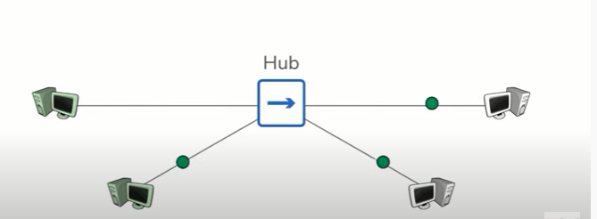
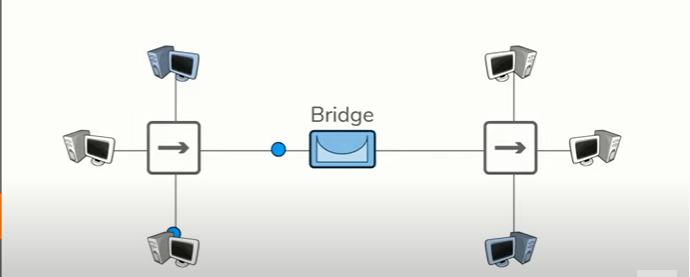
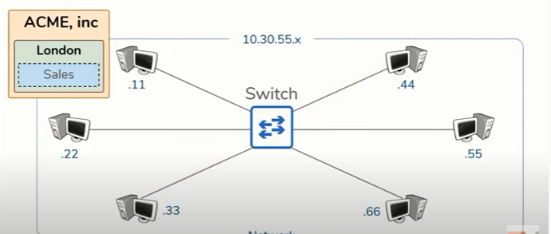

# Network Devices

### Network Devices
* Host

Host are any devices which send or either receives traffic/data over a network.
Examples: computers, phones, laptop, printer, server, cloudservers
Also Internet of Things devices (IoT) like TV, Speakers, Smart Watch, Lights, Refrigerator, Thermometers.
    * When they make a request, they are called Client
    * When they respond to a request they are called Server

So depending on the communication it acts as a Client or a Server.

       * Ip Address
       An IP address is the identity of a host. Everything send on the Internet needs a SRC and a DST IP address. So in a request u have a SRC and DST IP address and in the response also, this is put in the header in the Transport Layer (OSI) / Network Layer (TCP/IP)

       * A Network is what transports data traffic between hosts. The Internet is a network of networks.

* Repeater
A repeater regenerates/enhances the signal so u can communicate over larger distances. (wifi repeater)

* Hub
If u have multiple computers which need to be connected each to each other, u use a HUB. A Hub is a multi-port repeater.

There is only one big problem with a Hub, everything send between two computers will also be send to the othe other devices connected on that Hub/Network. To solve that problem we have bridges.

* Bridge

Bridges are used between Hub connected hosts.
Bridges have only two ports.
Bridges learn which hosts are on each side. They can sent data only on one side, or from one side to another on one or multiple computers.

* Switch
Switches facilitate communication within a Network (a group of hosts which all require the same connectivity)
Hosts on a Network share the same IP address space (
    i.e. only a few digits differ to give them all an unique IP address)

* Router

### The OSI Model and Network Devices

The OSI model is basically an overview of how data flows through the Internet.
The goal is too allow two or more hosts to share data with one another.

[Give a short summary of the subject matter.]

## Key terminology
[Write a list of key terminology with a short description. To prevent duplication you can reference to previous excersizes.]

## Exercise

### Sources

https://www.geeksforgeeks.org/network-devices-hub-repeater-bridge-switch-router-gateways/

[List your sources you used for solving the exercise]

### Overcome challanges
[Give a short description of your challanges you encountered, and how you solved them.]

### Results
[Describe here the result of the exercise. An image can speak more than a thousand words, include one when this wisdom applies.]
