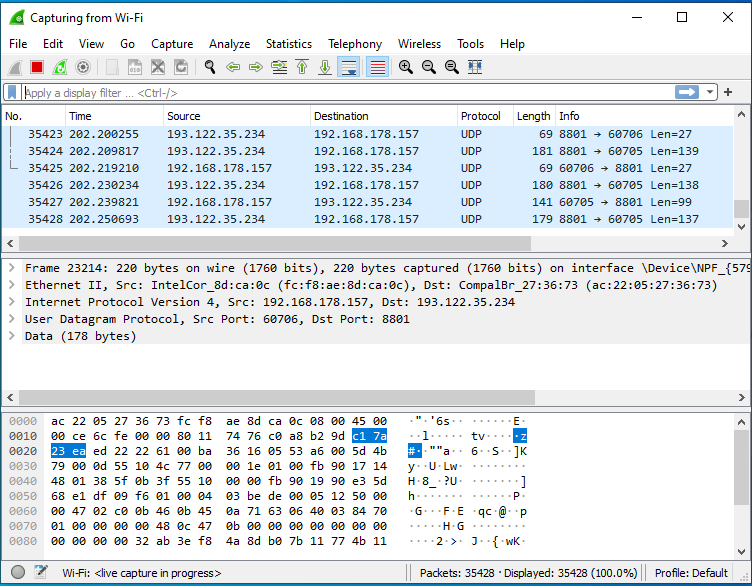
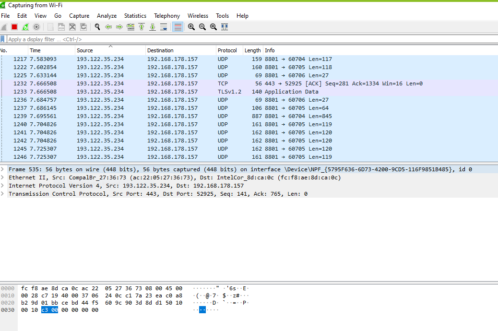

## Protocols

Protocols	

TCP and UDP Protocol

TCP (Transmission control protocol) and UDP (User datagram protocol)

A TCP (Transmission control protocol) connection is set up with the assistance of a 3-way handshake. It is a cycle of acknowledging and initiating a connection. When the connection is set up, the data move starts, and when the transmission cycle is done, the connection is ended.

The transmission control protocol is slower than the User datagram protocol as it performs mistake checking, stream control, and gives affirmation to the delivery of data packets, while the User datagram protocol is quicker than the transmission control protocol as it doesn’t ensure the delivery of data packets.

Transmission control protocol performs mistake checking by utilizing a checksum. At the point when the data is amended, at that point the data is retransmitted to the recipient, on the opposite side User datagram protocol doesn’t play out any mistake checking, and doesn’t resend the lost data packets. TCP is solid as it ensures delivery of data to the objective switch, while in the UDP the delivery of data to the objective can’t be ensured.

UDP (User datagram protocol) is used for multicast and broadcast type of network transmission. The User datagram protocol works practically like Transmission control protocol, however without any of the the back-and-forth deliverability & communication and all the error-checking.

The main difference is that the User datagram protocol is connectionless. That is: no connection builds up a preceding correspondence. It doesn’t mind whether the data has been gotten on the beneficiary’s end or not. It is otherwise called the “fire-and-forget” protocol as it sends the data and doesn’t mind if the data is not received.

* TCP is used by TCP examples are Secure Shell (SSH), File Transfer Protocol (FTP), E-mail (SMTP TCP), and World Wide Web (HTTP), HTTPs and Telnet.	
* UDP is used by Trivial File Transfer Protocol (TFTP), Voice over IP (VoIP), Online multiplayer games, Streaming media applications such as movies, and Domain Name System (DNS).  DHCP, SNMP, RIP,

***

###Transport layer – ports

* The transport layer must be able to separate and manage multiple application layer protocols, which may themselves open many individual sessions. For example, when you open multiple tabs in a web browser to view multiple webpages, the application layer protocol HTTP creates a separate session for each tab.

* At the same time as viewing multiple tabs you may also send email, instant messages and download files. Each of these activities requires an application layer protocol to establish simultaneous access to the network via the transport layer protocols TCP and UDP. The transport layer protocols need to track this activity and ensure that received data is directed to the correct application layer protocol otherwise, for example, webpage data may be directed towards an email application.

* TCP and UDP manage these multiple processes by using unique port numbers contained within the header field. They add the unique port numbers to the PDU created when encapsulating application layer data into segments and datagrams, respectively.

* Application layer protocols have different requirements from the transport layer. Some require reliable delivery of data (e.g. HTTP, FTP), whereas other require a low-delay service (e.g. DNS). Different application layer protocols are designed to operate with either TCP or UDP based on these requirements.

* This link between the application and transport layer protocols is based on the ports selected to support the individual sessions supported by the transport layer. There are 65,535 port numbers available, and these are divided into three ranges:
    * Well-known ports (0 to 1023). 
    These are reserved, and are commonly used by HTTP, SMTP, POP3, FTP, DNS, etc. Because they are reserved, client applications can be programmed to request a connection to a specific port and its associated transport layer service (TCP or UDP).
    * Registered ports (1024 to 49151). 
    These are assigned to user processes or applications, typically programs that you have chosen to install on your computer that require network connectivity (e.g. games and messaging services). When not assigned to a particular installed program, they can be used in the same manner as dynamic ports.
    * Dynamic or private ports (49152 to 65535). 
    These are assigned dynamically to client applications when the client initiates a connection to a service.

Some popular application layer protocols use by default predefined and well-known port numbers. For example, HTTP uses port 80, HTTPS uses port 443, SMTP port 25, Telnet port 23, and FTP uses two ports: 20 for data transmission and 21 for transmission control. The list of such default port numbers is managed by the Internet Assigned Numbers Authority organization.

A brief description of these are as follows:

Port 20 and 21: FTP data and FTP control, respectively

Port 22: Remote login protocol secure shell (SSH)

Port 23: Telnet, used for accessing system remotely but is not very secure

Port 25: Simple Mail Transfer Protocol (SMTP) used by e-mail servers

Port 53: DNS protocol

Port 80: Used for accessing Web servers

Port 110: The POP service or Post Office Protocol used by local e-mail clients to retrieve mail from servers

Port 123: NTP to synchronize time with remote time servers

Port 143: E-mail clients can use the Internet Message Access Protocol (IMAP) to retrieve mail from servers

Port 443: This is the Hypertext Transfer Protocol (HTTP) Secure that combines the HTTP with a cryptographic protocol, which can be used for payment transactions and other secure transmission of data from Web pages.

Port 631: The Internet Printing Protocol (IPP) used to print to printers located remotely on the network

Port 3306: The standard port for MySQL

These ports are defined in the /etc/services file on Linux systems.

***
## Key terminology

Protocols TCP and UDP

Other protocols corresponding to a layer of the OSI model

## Exercise

* Identify several other protocols and their associated OSI layer. Name at least one for each layer.

* Figure out who determines what protocols we use and what is needed to introduce your own protocol.

Network protocols are typically created according to industry standard by various networking or information technology organizations.

The following groups have defined and published different network protocols:

* The Institute of Electrical and Electronics Engineers (IEEE)
* The Internet Engineering Task Force (IETF)
* The International Organization for Standardization (ISO)
* The International Telecommunications Union (ITU)
* The World Wide Web Consortium (W3C)

While network protocol models generally work in similar ways, each protocol is unique and operates in the specific way detailed by the organization that created it.

Who Uses Network Protocols?
Network protocols aren’t only relevant to certified network specialists or IT professionals. Billions of people use network protocols daily, whether they know it or not.

Every time you use the internet, you leverage network protocols. Though you may not know how network protocols work or how frequently you encounter them, they are necessary for using the internet or digital communications in any capacity.

List of Network Protocols
There are thousands of different network protocols, but they all perform one of three primary actions:

Communication
Network management
Security
Each type is necessary to use network devices swiftly and safely, and they work together to facilitate that usage.

***

***
New emerging network protocols
If what we have is working so well, why do we need new protocols? Just examine the layers of functionality that are required to implement security, NAT, QoS, and content management. It gets complicated very quickly as the layers interact with one another. Some of the proposed protocols potentially result in network simplification. IPv6 was supposed to improve security, but further examination revealed some significant security holes, such as neighbor discovery and automatic tunneling.

The new protocols are:

Named Data Networking (NDN)
Recursive InterNetwork Architecture (RINA)
Enhanced IP
Easy IP (EZIP)

***

* Look into wireshark and install this program. Try and capture a bit of your own network data. Search for a protocol you know and try to understand how it functions.

My own laptop is 192.168.178.157 and UDP protocol is used to capture a lot of zoom packets on port 8801.

### Sources

all sources mentioned in NTW-01 en NTW-02

http://www.crypto-it.net/eng/theory/tcp-ip-protocols.html

https://www.geeksforgeeks.org/layers-of-osi-model/?ref=lbp

https://www.open.edu/openlearncreate/mod/oucontent/view.php?id=129631&section=7

https://www.pearsonitcertification.com/articles/article.aspx?p=2873377

http://www.iana.org/

https://www.comptia.org/content/guides/what-is-a-network-protocol#communication

https://cisomag.eccouncil.org/what-are-network-protocols-and-how-are-they-used/

https://www.nojitter.com/examining-emerging-network-protocols

https://www.wireshark.org/#download

### Overcome challenges

### Results
